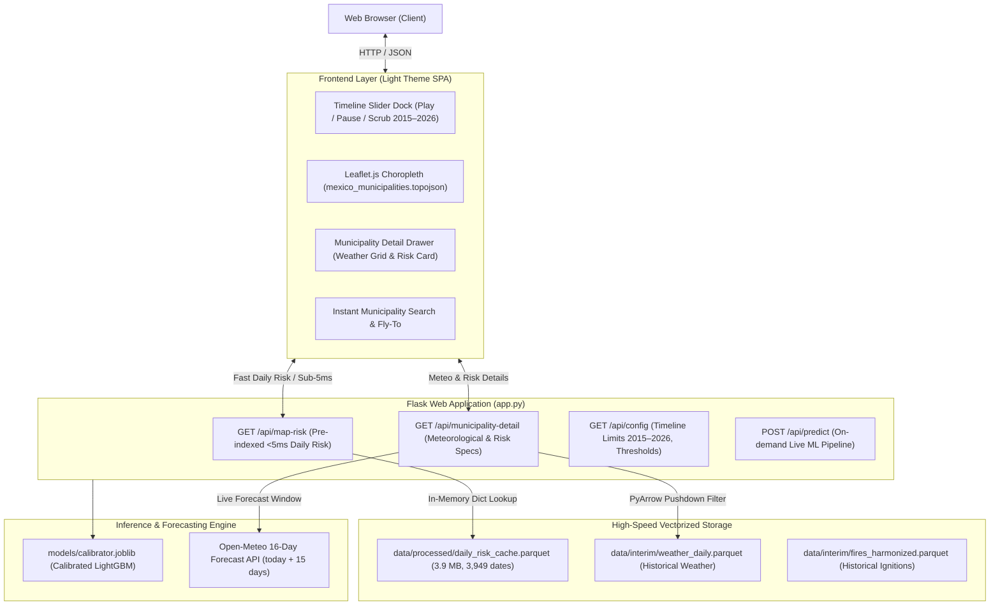

# Interactive Mexico Wildfire Risk Map — Documentation

## 1. Overview & Architecture

The **Interactive Mexico Wildfire Risk Map** is a dynamic geospatial choropleth application providing municipality-level wildfire ignition probability predictions across all Mexican municipalities. Powered by an end-to-end Machine Learning pipeline (Calibrated LightGBM with Isotonic Regression), the map visualizes Mexico's municipal regions colored by predicted risk (Low, Medium, High).

Users navigate through time using an interactive **Timeline Slider** spanning from **2015 to 2026 (`today + 15 days` forecast horizon)**. As the slider scrubs or automatically plays, regional colors dynamically update across the entire country. Clicking on any municipality polygon triggers a smooth **zoom-in effect** (`map.fitBounds`), opening a detail drawer displaying complete meteorological conditions, risk probability, and historical fire activity.

### High-Level System Architecture



---

## 2. Key Features

1. **Nationwide Dynamic Choropleth Map**:
   - Covers all 2,436 Mexican municipalities and 32 states using an optimized, lightweight TopoJSON boundary layer (`mexico_municipalities.topojson`, 1 MB).
   - Polygons are colored dynamically based on the model's calibrated risk thresholds:
     - **Low Risk** (`< 2.12%`): Soft Emerald Green (`#10b981`)
     - **Medium Risk** (`2.12% – 19.27%`): Warm Amber Orange (`#f59e0b`)
     - **High Risk** (`≥ 19.27%`): Vibrant Crimson Red (`#ef4444`)
     - **Confirmed Wildfire Ignition**: Highlighted polygon fill with fire status indicator (`🔥`)
     - **Unmodeled / Zero-Risk Baseline**: Subtle Slate Gray (`#e2e8f0`)

2. **Continuous 2015–2026 Timeline Slider**:
   - Timeline slider spans from **January 1, 2015** through **today + 15 days** (September 19, 2026).
   - **Play / Pause Button**: Fluid animated playback through calendar days with selectable speed (1x, 2x, 5x).
   - **Day Steppers**: Step backward (`<`) and forward (`>`) one day at a time.
   - **Historical Presets**: One-click jumps to notable periods:
     - `2017 Fire Peak` (April 29, 2017)
     - `2020 Drought` (May 15, 2020)
     - `2024 Fire Wave` (May 15, 2024)
     - `2025 Baseline` (May 15, 2025)
     - `Today` (Live conditions)
     - `+15d Forecast` (Forecast horizon limit)

3. **Sub-5ms Scrubbing via In-Memory Risk Index**:
   - Model predictions for all 1,737 municipalities across 3,949 calendar dates are pre-indexed in `daily_risk_cache.parquet` (3.9 MB) and loaded into server memory at startup.
   - Slider dragging achieves 60fps responsiveness with zero backend lag.

4. **Polygon Click & Smooth Zoom-In Effect**:
   - Clicking any municipality polygon halts playback and executes smooth camera zoom (`map.fitBounds`) focused directly on the municipality geometry.
   - The selected municipality is highlighted with a vivid blue border.
   - The right-side **Detail Drawer** opens automatically to present complete data.

5. **Comprehensive Meteorological Conditions Grid (9 Parameters)**:
   - Max Temperature (°C)
   - Min Temperature (°C)
   - Mean Temperature (°C)
   - Relative Humidity (%)
   - Daily Precipitation (mm)
   - Maximum Wind Speed (km/h)
   - Maximum Wind Gusts (km/h)
   - Reference Evapotranspiration ET0 (mm)
   - Consecutive Dry Days (streak length)

6. **Instant Municipality Search & Auto Fly-To**:
   - Type-ahead search bar in the top navigation bar matching both municipality and state names.
   - Selecting a result automatically pans/zooms to the polygon and opens its detailed inspection panel.

---

## 3. Design System (Light Theme Palette)

| Element | Color Code | Description |
| :--- | :--- | :--- |
| **Background Void** | `#f8fafc` | Soft cool light background |
| **Surface Card** | `#ffffff` | Clean white cards & drawer |
| **Elevated / Border** | `#f1f5f9` / `rgba(15,23,42,0.08)` | Subtle demarcation |
| **Text Primary** | `#0f172a` | Deep slate for readability |
| **Text Secondary** | `#475569` | Balanced slate for descriptions |
| **High Risk** | `#ef4444` | Crimson red indicator |
| **Medium Risk** | `#f59e0b` | Amber orange indicator |
| **Low Risk** | `#10b981` | Emerald green indicator |
| **Primary Accent** | `#2563eb` | Vibrant royal blue |

---

## 4. REST API Reference

### 1. `GET /api/config`
Returns timeline configuration, slider date limits, and calibrated model risk thresholds.

**Response:**
```json
{
  "min_date": "2015-01-01",
  "max_date": "2026-09-19",
  "today": "2026-09-04",
  "default_date": "2024-05-15",
  "max_forecast_days": 15,
  "thresholds": {
    "medium_threshold": 2.12,
    "high_threshold": 19.27
  },
  "total_municipalities": 1737,
  "available_dates_count": 3949
}
```

### 2. `GET /api/map-risk?date=YYYY-MM-DD`
Returns nationwide risk predictions across all Mexican municipalities for the requested date.

**Query Parameters:**
- `date` (*string, required*): ISO date format `YYYY-MM-DD`.

**Response:**
```json
{
  "date": "2024-05-15",
  "found": true,
  "summary": {
    "high": 68,
    "medium": 466,
    "low": 1203,
    "fires": 57
  },
  "risks": {
    "01003": {
      "risk": "MEDIUM",
      "prob": 7.7,
      "fires": 0
    },
    "09012": {
      "risk": "HIGH",
      "prob": 26.4,
      "fires": 1
    }
  }
}
```

### 3. `GET /api/municipality-detail?cvegeo=...&date=...`
Returns complete meteorological measurements, calibrated wildfire risk, and historical fire info for a specific municipality and date.

**Query Parameters:**
- `cvegeo` (*string, required*): 5-digit INEGI code (e.g. `01003`).
- `date` (*string, required*): ISO date format `YYYY-MM-DD`.

**Response:**
```json
{
  "cvegeo": "01003",
  "municipio": "Calvillo",
  "estado": "Aguascalientes",
  "municipio_display": "Calvillo",
  "estado_display": "Aguascalientes",
  "lat": 21.8468,
  "lon": -102.7188,
  "date": "2024-05-15",
  "risk_level": "MEDIUM",
  "probability": 7.7,
  "fires_count": 0,
  "data_source": "ERA5 Reanalysis (Historical)",
  "weather": {
    "temp_max_c": 32.66,
    "temp_min_c": 13.13,
    "temp_mean_c": 22.34,
    "relative_humidity_pct": 20.36,
    "precipitation_mm": 0.0,
    "wind_speed_kmh": 3.86,
    "wind_gusts_kmh": 5.02,
    "evapotranspiration_mm": null,
    "consecutive_dry_days": 5
  },
  "thresholds": {
    "medium_threshold": 2.12,
    "high_threshold": 19.27
  }
}
```

---

## 5. Verification & Testing

To run the automated test suite covering all map and ML endpoints:

```bash
# Run all tests
pytest tests/
```

Test coverage includes:
- `test_config_endpoint`: Validates timeline bounds and thresholds.
- `test_map_risk_endpoint_historical`: Validates nationwide choropleth data on historical dates.
- `test_map_risk_endpoint_2026`: Validates forecast horizon risk retrieval.
- `test_municipality_detail_endpoint`: Validates meteorological grid and risk parameters.
- `test_topojson_file_accessible`: Validates spatial polygon delivery.
